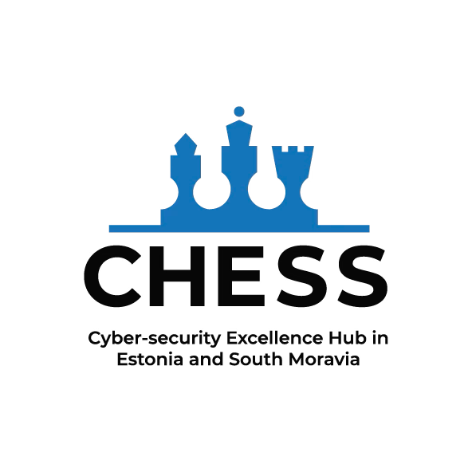

# LatticeHelper

Idea to create this library came up from seeing concrete similarities between different custom PQ lattice-based protocols (two-party signature and e-vote casting).

The purpose is to have a common set of full-fledged functions available in multiple components. This will allow for a more consistent and efficient development of PQ components.

Under the hood, it is utilizing [LattiGo library](https://github.com/tuneinsight/lattigo) for it's ring capabilities (and most importantly NTT and INTT functions for fast polynomial multiplication).

## Features

- Polynomial arithmetic in two different rings:
    - ring `R` over Z[X]/(X^d + 1)
        - coefficients are all natural numbers, poly is modulo X^d + 1
        - in this library, naming is regular `poly...`
    - ring `Rq` over Z_q[X]/(X^d + 1)
        - coefficients are in range from 0 to q-1, poly is modulo X^d + 1
        - in this library, naming is `polyQ...`
- Vector and matrix arithmetic in both rings.
- some util functions like Power2Round, checking bounds, norms, etc.

## Install

Use `go get github.com/isri-pqc/latticehelper` to download and use in your Go module.

## Initialization

`latticehelper.InitSingle()` or `latticehelper.InitMultiple()` MUST be called at least once before using anything related to `polyQ`. Arguments for `latticehelper.InitSingle()` are maximum degree of polynomial `d` \+ single modulus `q`.

`InitMultiple` can prepare underlying parameters between multiple rings `Rq`, but has not been tested that much yet. Second argument must be a slice of moduli `[q1, q2, q3,...]`. 

## Concurrency

If not stated otherwise, all functions should be thread safe and do not require any locks.

Only exceptions to that rule are functions `NewRandomPolyQ{matrix|vector|""}`, which require a thread-unique sampler. If these functions are used concurrently (i.e. called multiple times at the same time), create new sampler in each thread by `latticehelper.NewSampler` for them.

## Acknowledgements

Developed under [CHESS project](https://chess-eu.cs.ut.ee/).

Funded by the European Union under Grant Agreement No. 101087529. Views and opinions expressed are however
those of the author(s) only and do not necessarily reflect those of the European Union or European Research
Executive Agency. Neither the European Union nor the granting authority can be held responsible for them.

